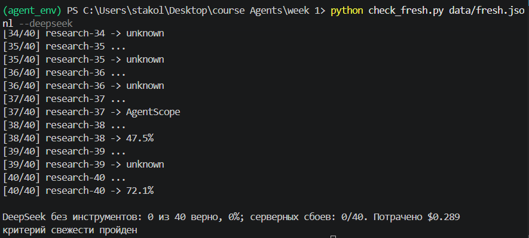
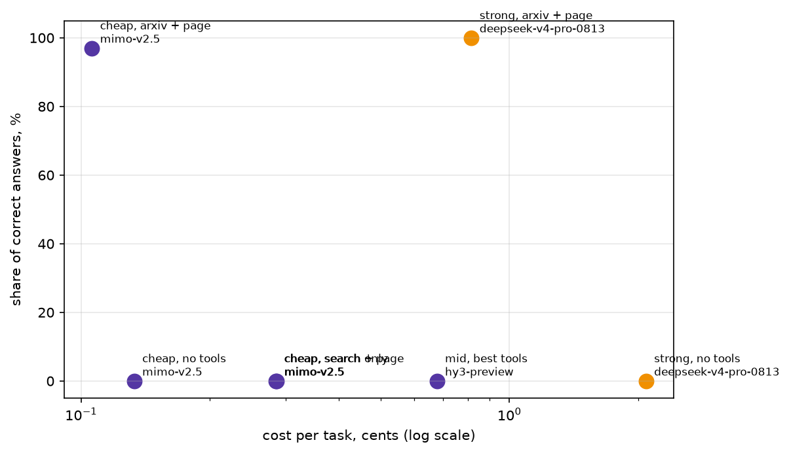
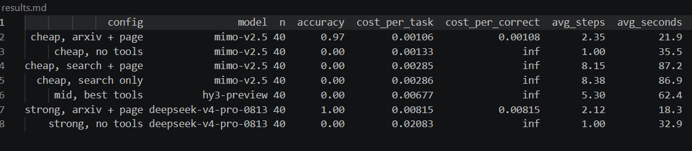

# LLM agent for data extraction from research papers

## Тема подборки

Тема подборки — harnesses в исследованиях, опубликованных после 2026 года. Я попросил Gemini найти соответствующие работы на arXiv, дав указание сначала проверить содержащиеся в них факты и лишь на их основе сформулировать вопросы и привести подтверждающие данные.

## Результаты

## Тезис
Подтверждается основной вывод: недорогая модель, использующая дополнительные инструменты, превосходит по эффективности дорогую модель без них. Кроме того, результаты показывают, что при работе без инструментов точность всех типов моделей равна нулю, однако разница в цене сохраняется.

## Разборы

Link: traces\strong, no tools\deepseek-v4-pro-0813\research-12.json

Модель ответила неверно, правильный ответ - «Paimon», 
а модель ответила "FINAL: AIMONS".

Link: traces\cheap, search only\mimo-v2.5\research-4.json

Модель прекратила попытки дать ответ, так как не смогла найти статью на arXiv и сформировать ответ из своих весов.